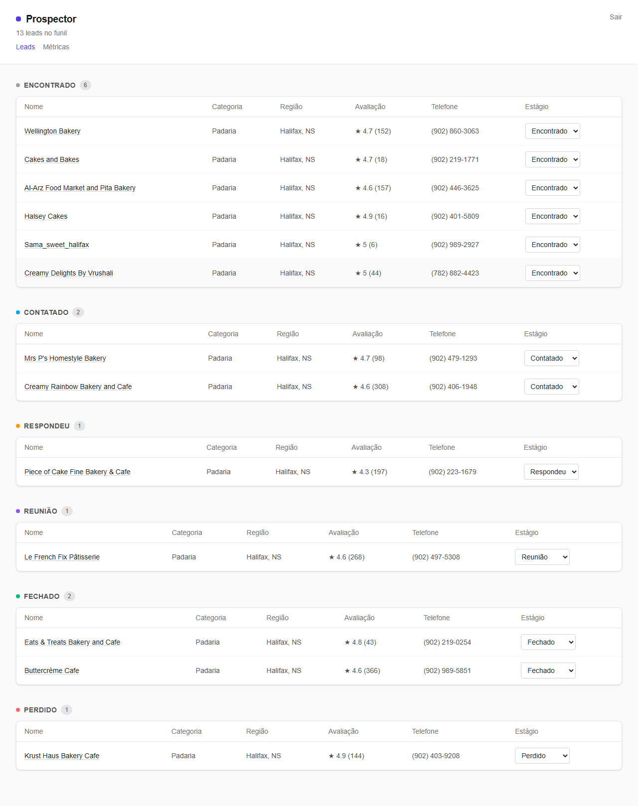
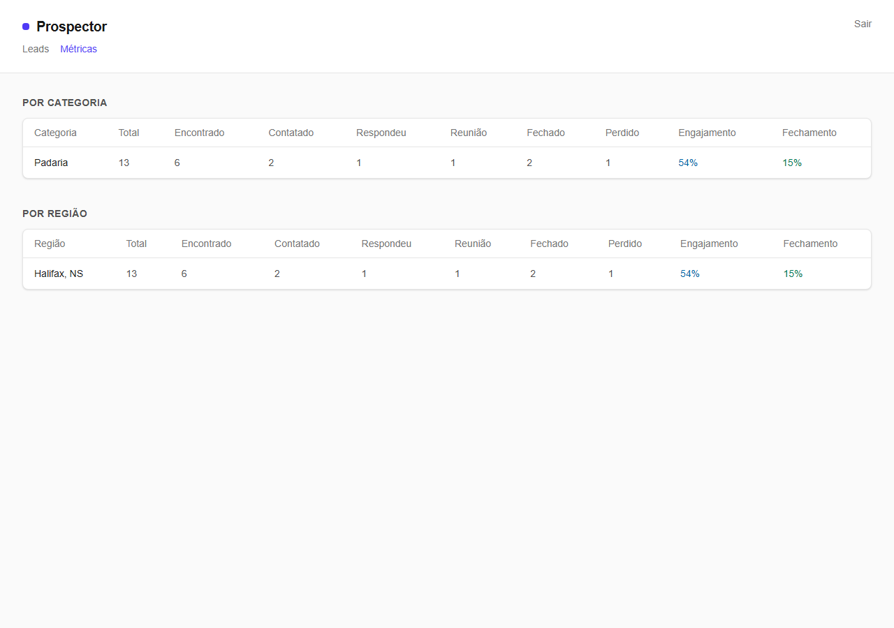
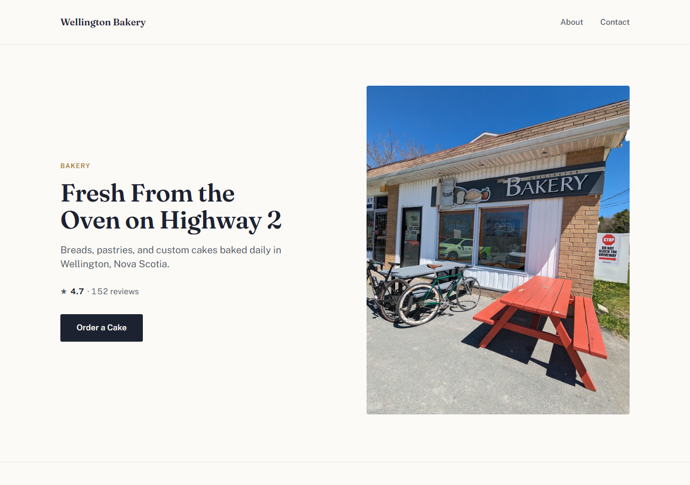
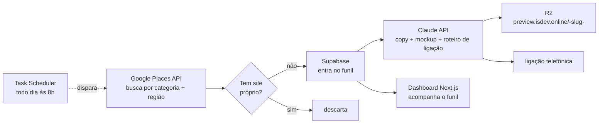

<p align="center">
  
</p>

# Prospector

Prospector é uma automação de geração de leads: encontra negócios locais nos EUA
e Canadá que não têm site próprio, gera uma proposta personalizada (copy de
e-mail, mockup de landing page e roteiro de ligação) com IA, publica o mockup
numa URL de verdade e acompanha tudo num CRM até fechar negócio — rodando
sozinho, todo dia, sem intervenção manual.

Construído em público, fase por fase, do zero até produção.

## Ao vivo

- **Dashboard**: [prospector.santanaismael042.workers.dev](https://prospector.santanaismael042.workers.dev)
  (crie uma conta pra entrar — é um CRM de uso pessoal, sem dados de terceiros)
- **Exemplo de mockup gerado**: [preview.isdev.online/wellington-bakery](https://preview.isdev.online/wellington-bakery)

| Dashboard | Métricas |
|---|---|
|  |  |

**Mockup de landing page gerado por IA**, com foto real do negócio (Google Places),
tipografia e paleta autorais (não gerada por IA — só o texto é):



## Como funciona



Tudo isso roda sozinho via **Task Scheduler** todo dia: busca negócios novos,
sincroniza com o CRM e gera a proposta — de forma **idempotente** (nunca gera
duas vezes o mesmo lead) e com log rotativo. Publicar o mockup continua sendo
uma decisão manual, pra revisar a copy da IA antes dela ficar pública sob o
domínio próprio.

## Stack

**Automação/backend:** Python · Google Places API · Claude API (Anthropic,
`claude-opus-5`) · Supabase (Postgres + Auth) · boto3 (Cloudflare R2)

**Dashboard:** Next.js (App Router) · TypeScript · Tailwind CSS · Supabase
Auth/RLS

**Infra:** Cloudflare Workers (via [vinext](https://developers.cloudflare.com/workers/framework-guides/web-apps/nextjs/))
· Cloudflare R2 · Supabase Cloud · Windows Task Scheduler

## Setup

### 1. Credenciais (`.env` na raiz)

```bash
cp .env.example .env
```

| Variável | Onde conseguir |
|---|---|
| `GOOGLE_PLACES_API_KEY` | [Google Cloud Console](https://console.cloud.google.com/) → ativar **Places API (New)** |
| `ANTHROPIC_API_KEY` | [console.anthropic.com](https://console.anthropic.com/) |
| `SUPABASE_URL` / `SUPABASE_SECRET_KEY` | Projeto no [Supabase](https://supabase.com/dashboard) (ou `supabase start` local, via Docker) |
| `R2_ACCOUNT_ID` / `R2_ACCESS_KEY_ID` / `R2_SECRET_ACCESS_KEY` / `R2_BUCKET_NAME` | Cloudflare → R2 → bucket + API Token |
| `PREVIEW_BASE_URL` | Domínio customizado apontado pro bucket R2 |

```bash
pip install -r requirements.txt
```

### 2. Schema do banco

Rode o SQL de `supabase/migrations/` no seu projeto Supabase (via `supabase db
push` se estiver linkado, ou colando no SQL Editor).

### 3. Dashboard

```bash
cd dashboard
cp .env.local.example .env.local   # URL + chave publishable do Supabase
npm install
npm run dev
```

## Uso

```bash
# 1. Busca negócios sem site
python -m prospector.search --category "bakery" --location "Halifax, NS" --max-results 60

# 2. Sincroniza com o CRM (Supabase)
python -m prospector.sync_supabase --input data/results_....csv --category "bakery" --location "Halifax, NS"

# 3. Gera copy de e-mail + mockup + roteiro de ligação (Claude API)
python -m prospector.generate --input data/results_....csv --category "bakery" --limit 5

# 4. Publica o mockup em preview.isdev.online/<slug>
python -m prospector.publish --slug wellington-bakery
# ou --all pra publicar todo mundo já gerado

# Roda os passos 1-3 pra toda a watchlist (prospector/watchlist.py), pulando
# quem já foi processado - é isso que o Task Scheduler dispara todo dia
python -m prospector.scheduled_run
```

## Estrutura

```
prospector/
  places_client.py    # Google Places API (busca + fotos)
  filters.py           # heurística de "sem site real"
  search.py             # CLI: busca -> CSV
  ai_client.py           # Claude API: copy estruturada por lead
  template.py             # template HTML/CSS autoral do mockup
  generate.py               # CLI: copy + mockup + roteiro de ligação
  sync_supabase.py           # CSV -> CRM (idempotente)
  publish.py                  # mockup -> R2 (preview.isdev.online)
  watchlist.py                 # categorias/regiões monitoradas
  scheduled_run.py               # pipeline completo, log rotativo
supabase/
  migrations/                     # schema + RLS
dashboard/
  src/app/                         # Next.js: leads, métricas, login
```

## Roadmap

- [x] **Fase 0 — Setup**: repositório, credenciais, estrutura do projeto
- [x] **Fase 1 — Descoberta & Filtro**: buscar negócios por categoria/região e
      identificar quem não tem site real
- [x] **Fase 2 — Geração de Isca (IA)**: copy personalizada + mockup de landing page
      gerados por LLM para cada lead
- [x] **Fase 3 — Outreach**: roteiro de ligação personalizado por lead (a Places
      API não retorna e-mail do negócio, então o canal virou telefone)
- [x] **Fase 4 — CRM / Dashboard**: funil de vendas em Next.js + Supabase, com
      autenticação e métricas de conversão
- [x] **Fase 5 — Deploy & Operação**: Supabase Cloud, dashboard em produção no
      Cloudflare Workers, mockups publicados via R2, agendamento diário com log
      rotativo

## Licença

MIT — ver [LICENSE](LICENSE).
